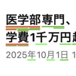

# Anki Levels

A Chrome extension that highlights words on web pages based on your Anki card difficulty levels, helping you visualize which words you know well and which need more practice.

## Screenshots


_Words highlighted with color-coded difficulty levels and overlapping word detection_


_Tooltip showing difficulty percentage on hover_


_Multiple words highlighted across different difficulty levels_

## Features

- **Smart Word Highlighting**: Automatically highlights words from your Anki deck as you browse the web
- **Color-Coded Difficulty**: Words are color-coded from red (difficult) to green (easy) based on your card statistics
- **Overlapping Word Detection**: Handles overlapping words intelligently with stacked underlines
- **Performance Optimized**: Uses IndexedDB caching and efficient batch processing for smooth browsing
- **Automatic Syncing**: Syncs with your Anki database every 24 hours automatically

## Prerequisites

- [Anki](https://apps.ankiweb.net/) desktop application
- [AnkiConnect](https://ankiweb.net/shared/info/2055492159) add-on installed in Anki
- Chrome browser

## Installation

1. Clone this repository or download the source code
2. Install dependencies:
   ```bash
   npm install
   ```
3. Build the extension:
   ```bash
   npm run build
   ```
4. Load the extension in Chrome:
   - Open Chrome and navigate to `chrome://extensions/`
   - Enable "Developer mode" (toggle in top right)
   - Click "Load unpacked"
   - Select the `.output/chrome-mv3` folder from the build

## Setup

1. Make sure Anki is running with the AnkiConnect add-on enabled
2. Configure the extension with your deck name:
   - Click the extension icon in Chrome
   - Enter your Anki deck name (e.g., "My Japanese Deck")
   - The extension will sync with your deck automatically

## How It Works

The extension analyzes your Anki cards to determine difficulty levels based on:

- **Interval**: Longer intervals indicate better retention (easier words)
- **Lapses**: More mistakes indicate harder words
- **Repetitions**: More reviews with good intervals indicate mastery

Words are then highlighted on web pages with:

- **Background color**: Based on the primary word match's difficulty
- **Underlines**: Color-coded lines showing all matching words (handles overlaps)
- **Tooltips**: Hover to see difficulty percentages

## Color Scale

- **Red (0%)**: New or very difficult words
- **Orange-Yellow (25-50%)**: Learning words
- **Yellow-Green (50-75%)**: Known words
- **Green (100%)**: Well-mastered words

## Development

```bash
# Development mode with hot reload
npm run dev

# Build for production
npm run build

# Create distribution zip
npm run zip

# Firefox support
npm run build:firefox
npm run zip:firefox
```

## Privacy

All data is stored locally in your browser. The extension only communicates with:

- Your local Anki instance (localhost:8765)
- No external servers or third parties

## License

MIT

## Credits

Built with [WXT](https://wxt.dev/) framework for cross-browser extension development.
